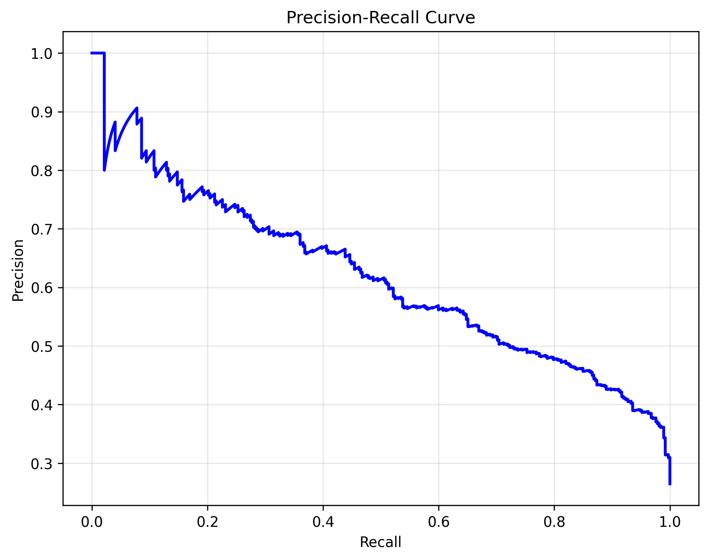

# Model Evaluation Report

## Performance Metrics
- **ROC-AUC Score**: 0.8256
- **Precision**: 0.5856
- **Recall**: 0.5242
- **F1-Score**: 0.5532
- **Accuracy**: 0.7758

## Classification Report
```
              precision    recall  f1-score   support

   Not Churn       0.83      0.87      0.85      1033
       Churn       0.59      0.52      0.55       372

    accuracy                           0.78      1405
   macro avg       0.71      0.70      0.70      1405
weighted avg       0.77      0.78      0.77      1405

```

## Business Impact
- **Customers Saved**: 195
- **Revenue Saved**: $234,000.00
- **Campaign Cost**: $16,650.00
- **ROI**: 1305.41%
- **Missed Churners**: 177
- **Potential Revenue Loss**: $212,400.00

## Visualizations



