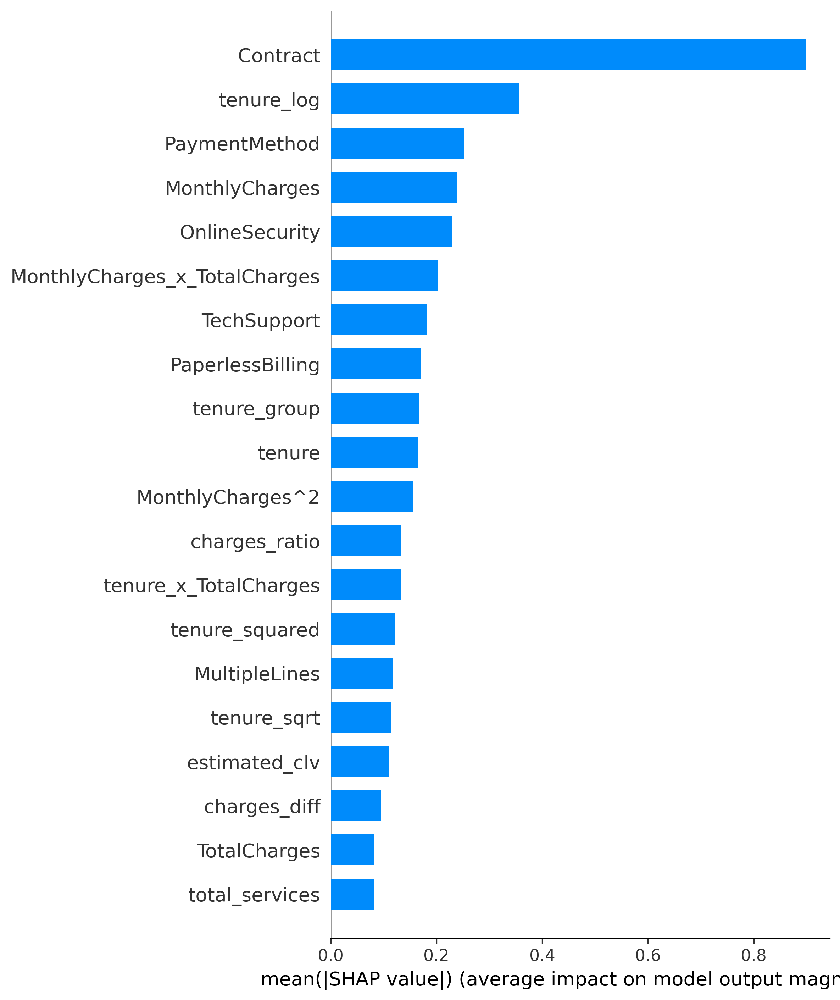
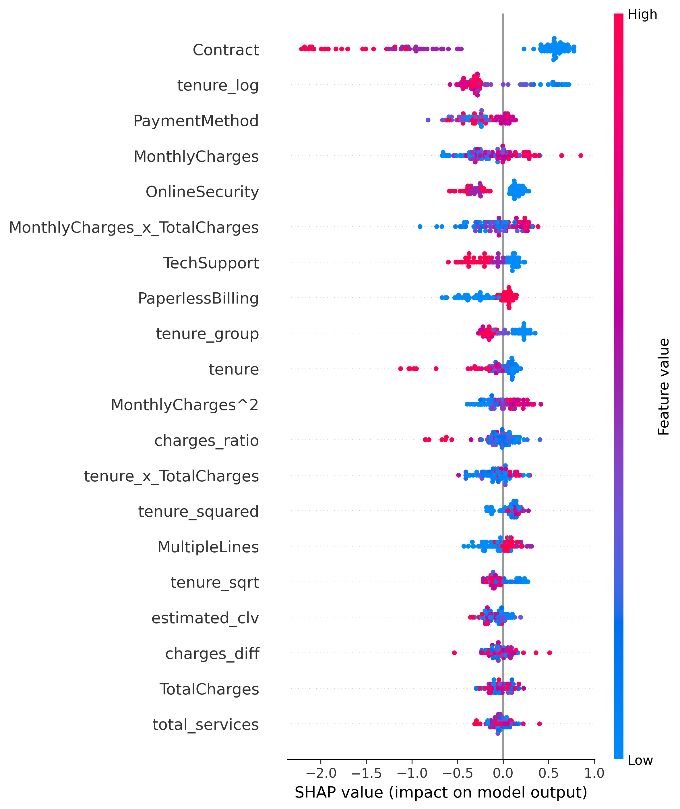

# Model Explainability Report

## Top 10 Most Important Features

| Rank | Feature | Importance |
|------|---------|------------|
| 15 | Contract | 0.8988 |
| 22 | tenure_log | 0.3570 |
| 17 | PaymentMethod | 0.2532 |
| 18 | MonthlyCharges | 0.2393 |
| 9 | OnlineSecurity | 0.2295 |
| 36 | MonthlyCharges_x_TotalCharges | 0.2021 |
| 12 | TechSupport | 0.1826 |
| 16 | PaperlessBilling | 0.1712 |
| 23 | tenure_group | 0.1664 |
| 5 | tenure | 0.1655 |

## SHAP Visualizations

### Feature Importance

### SHAP Summary Plot

## Interpretation Guide

- **Positive SHAP values** (red): Push prediction towards churn
- **Negative SHAP values** (blue): Push prediction away from churn
- **Magnitude**: Indicates strength of feature impact

## Key Insights

Based on SHAP analysis, the top factors driving churn predictions are:

15. **Contract**: High impact on predictions
22. **tenure_log**: High impact on predictions
17. **PaymentMethod**: High impact on predictions
18. **MonthlyCharges**: High impact on predictions
9. **OnlineSecurity**: High impact on predictions
